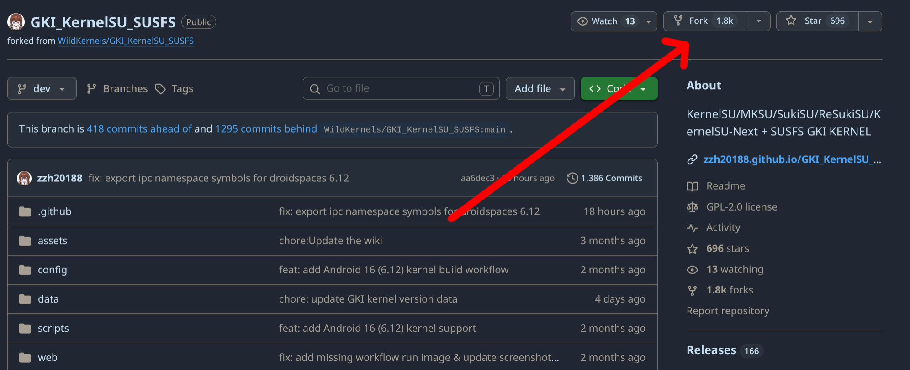
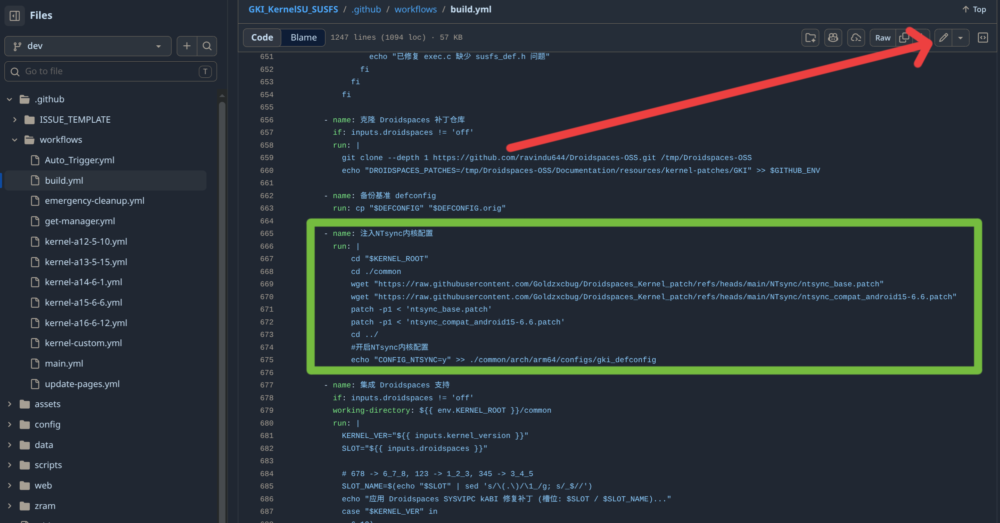

# GKI内核 云端编译指南 
- 适用设备：小米，红米
- 适用内核版本：6.1-6.12
>[!TIP]
>
>本教程仅适用于编译支持 **Droidspaces** 和 **NTsync** 的内核
>
>请严格按照教学，以确保内核编译不出错并完美运行


## 前提准备：
- 知道 [Droidspaces项目](https://github.com/ravindu644/Droidspaces-OSS) 是干什么的
- 一台解了 Bootloader 锁的设备，设备建议高通骁龙(否则没有GPU加速)
- 查看 `设置－>我的设备->全部参数与信息->内核版本` 是否为 `5.10.xxx~6.12.xxx` 内核版本
- 备份好你的手机对应的原 `Boot` 文件
- 系统必须是 `MIUI` `HyperOS`

## 配置
### 1.查看本项目主页的表格的GKI系列的内核版本状态是否有 ✅完美运行
- 如果你的机型正好是测试通过的机型，那么恭喜你，你只要严格按照本教程来，100%获得完美支持DroidSpaces的内核
- 你的机型如果不是测试通过的机型，那也不用慌张，打上内核版本相同的补丁，大概率也可以获得完美支持DroidSpaces的内核
### 2.Fork [zzh20188](https://github.com/zzh20188) 的内核项目
- GKI内核5.10~6.12 https://github.com/zzh20188/GKI_KernelSU_SUSFS

>[!WARNING]
>我在写这个教程的时候，作者已经添加了对 `Droidspaces` 的实验性支持，我看了看代码，基本没有问题
>
>但还是要备份好你的手机对应的原 `Boot` 文件


### (可选).添加对 `NTsync` 的支持
1. 先回到本项目中,查看表格中的 `NTsync 所需补丁` 
2. 进入 <ins>/NTsync</ins> 文件夹，复制补丁的`Raw`链接
3. 打开你 `Fork项目` 里的 <ins>/.github/workflows/build.yml</ins> 文件
4. 编辑文件，在 `集成 Droidspaces 支持` 流程前，插入并应用补丁开启配置

例子:若你的设备是 `小米 Pad 8 PRO` ，发现你的内核版本为6.6
```yml
      - name: 注入NTsync内核配置
        run: |
            cd "$KERNEL_ROOT"
            cd ./common
            wget "https://raw.githubusercontent.com/Goldzxcbug/Droidspaces_Kernel_patch/refs/heads/main/NTsync/ntsync_base.patch"
            wget "https://raw.githubusercontent.com/Goldzxcbug/Droidspaces_Kernel_patch/refs/heads/main/NTsync/ntsync_compat_android15-6.6.patch"
            patch -p1 < 'ntsync_base.patch'
            patch -p1 < 'ntsync_compat_android15-6.6.patch'            
            cd ../
            #开启NTsync内核配置
            echo "CONFIG_NTSYNC=y" >> ./common/arch/arm64/configs/gki_defconfig
```

### 3.手动触发Actions的对应工作流，等待20min左右的AK3出炉
- 运行工作流之前，可以优先查看本仓库GKI测试通过的机型，可以点开<ins>/GKI/内核版本</ins> 文件夹，查看补丁为1_2_3还是3_4_5
- 如果你的设备不是测试通过的机型，但是有内核大版本相同，可以优先选择该编号（比如你的机型是 `小米15` 但不属于测试通过的机型，查看内核版本为6.6,有测试成功的内核，查看<ins>/GKI/6.6</ins> 文件夹，发现是3_4_5.那就优先使用3_4_5）
#### 建议配置
1. KernelSU分支选择Resukisu,ksu分支标准
2. 启动禁用 SUSFS
3. 其他保持默认
- 刷入Ak3包，运行 `Droidspaces` 检查，并运行容器，设备长时间运行并不崩溃，则为 ✅完美运行
- 如果卡一屏，开不了机，但是测试通过的机型，可以检查哪一步出错，还是Actions配置选错
- 如果卡一屏，开不了机, 而且是内核版本有通过的机型，但本身不是测试通过的机型，并严格按照本教程来，可以测试`Droidspaces`给出的sysvipc的其他补丁1_2_3,3_4_5,5_6_7
